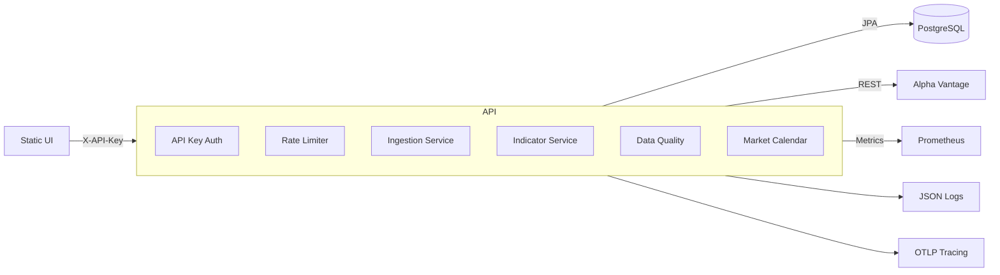

# Architecture

MarketLens is a modular Spring Boot service for ingesting market data and serving analytics. It emphasizes idempotent ingestion, strong observability, and a clean UX.

## System Diagram

## Key Modules

- **security/**: API key auth and rate limiting filters.
- **service/ingestion/**: ingestion runs, backfills, idempotency.
- **service/indicator/**: RSI + MACD calculations.
- **service/market/**: adjusted prices and corporate actions.
- **service/calendar/**: trading day logic and holidays.
- **service/quality/**: data quality checks.

## Data Model Highlights

- `price_candle` partitioned by year
- `pipeline_run` for run tracking and retries
- `corporate_action` for adjustments
